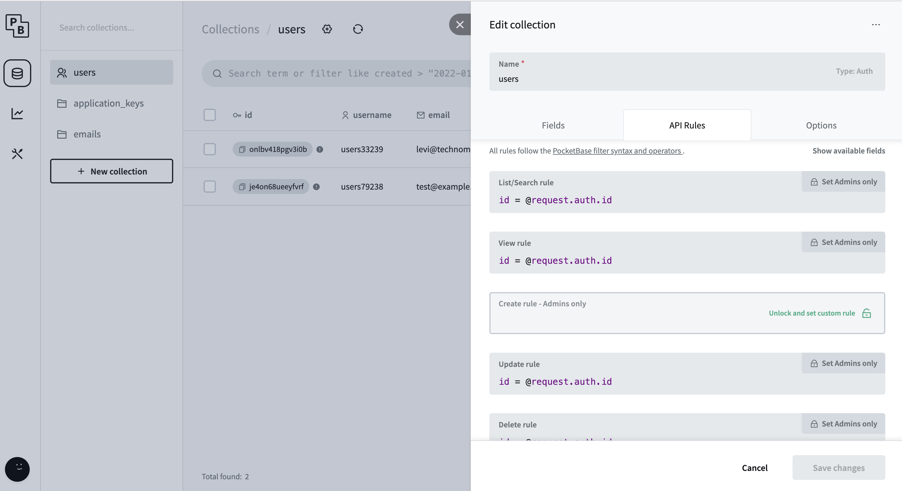

> 🚨 This is EXTREMELY alpha 🚨\
> The docs are incomplete, the code needs much better error handling, and changes need to be made to limit sign ups. If you want to use this before these issues are solved take caution.

> IF THINGS ARE NO LONGER WORKING PLEASE RE-READ THE GUIDE THINGS HAVE LIKELY CHANGED.

# Double Zero is an email monitoring micro-service for the people!

Amazon SES is a cost effective way to send a lot of emails, but it has a horrible user experience for most applications.

Sending could be a simple API endpoint to send html or markdown to, and a simple dashboard for monitoring email status.

Instead you need to send through an SMTP setup, and monitoring in the AWS dashboard is horrible, and arguably not even really possible resulting in you needing to make an endpoint and dashboard for SNS events.

That is what 00 was made to solve. 00 is that dashboard, complete with an endpoint for sending your markdown or HTML emails.

## Getting Started

To get started clone the repo then:

```
cd 00
npm i
npm run db:serve
```

This should give you an output like this.

```
Server started at http://127.0.0.1:8090
├─ REST API: http://127.0.0.1:8090/api/
└─ Admin UI: http://127.0.0.1:8090/_/
```

This is a [pocketbase](https://pocketbase.io/) database. Visit the admin ui at http://127.0.0.1:8090/\_/ and create your first Admin.

You will need a system admin, this is used to authenitcate you from your API key. You can use the admin you just made, or set up another.

Next, lets make an `.env` file and store the system admin credentials there, along with a few other needed items.

```
# AWS KEYS NEEDED IF USING SEND API
AWS_SECRET_KEY=""
AWS_ACCESS_KEY=""

# Admin cedentials you just made. 
ADMIN_EMAIL=""
ADMIN_PASSWORD=""

# where your production db can be reached
# only needed once deployed. 
PRODUCTION_DB_URL="" 
```

Once those are all set, you can run `npm run dev` which should result in the following output.

```
> dev
> vite


  VITE v5.2.10  ready in 490 ms

  ➜  Local:   http://localhost:5173/
  ➜  Network: use --host to expose
  ➜  press h + enter to show help
```

Open up http://localhost:5173/ and you should see the following.


Congrats! You are done with the config on the 00 side of things.

You can create your first user by visiting [The sign up page](http://localhost:5173/auth/sign-up)

> The section below has changed, your keys are env variables now, we just need your AWS Account ID

After that you will be given your API key, ~~and asked for your AWS access and secret keys.~~ Your API key will be hashed, so save it since there is no way to ever see it again (even in the database admin) but you can always generate a new one. ~~Your AWS keys will be encrypted which is nice incase you leak your database.~~

After creating your first user, you may want to prevent anyone from making more. You can easily do this with the pocketbase admin UI. Simply navigate to the Users collection, click the gear to edit the collection, click API rules, then click the lock next to the create rule to make creating users an admin only action.



## AWS setup.

A better guide for this will come later, for now I will assume you know a bit about AWS SES and SNS. If you don't you can get through this with some light google-fu.

First, make an SES account if you do not have one, and set up your DNS stuff for your domain.

Then generate an access key. (Click your user in top left, then Security Credentials)

Now make a "configuration set" I called mine default, I don't think it matters.

Add an "event destination" to your config set, pick the events you care about, select Amazon SNS, pick a name, make a topic.

Add a subscription to the topic, select HTTPS for protocol, the endpoint should be where you host this, or some exposed endpoint for local testing (like with ngrok) `https://yourdomain.com/aws/sns`

00 will take care of confirming the subscription.

Now you are ready to deploy this if you haven't at this point! You will need to make a new subscription with your production url if you made one with ngrok in the last few steps.
