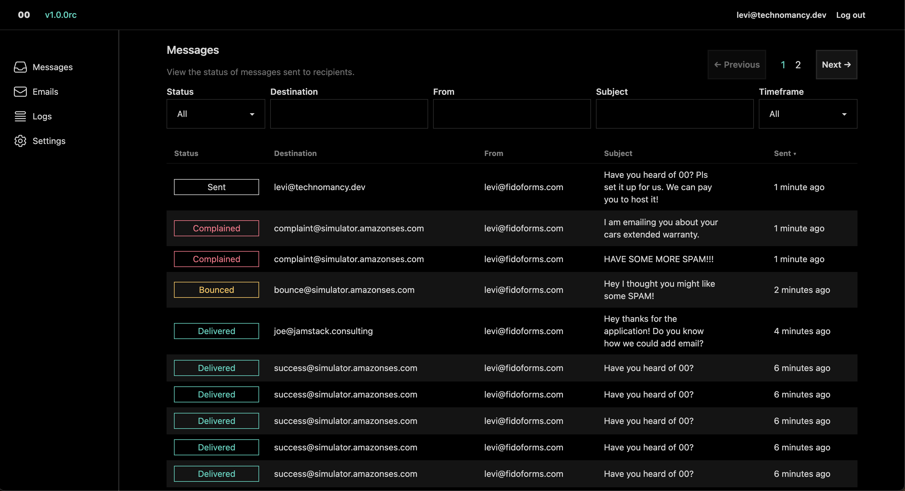

> [!CAUTION]
> I have discovered an issue for sending emails to multiple recipients. I will be making a major change to all the tables to fix this and migration to the next update will not be possible. Just a heads up. PS. This issue exists in the closed source alternative to this library too.




## Getting started

We publish a docker image to the [registery](https://hub.docker.com/r/liltechnomancer/double-zero)

Simply run `docker pull liltechnomancer/double-zero`

Then run your docker container with the following environment variables set. Exposing port 4000.

Example `docker run -it --env-file ./env -p 80:4000 "liltechnomancer/double-zero"`

```
export AWS_SECRET_ACCESS_KEY=""
export AWS_ACCESS_KEY_ID=""
export AWS_REGION="" # Ex: us-east-1

export SYSTEM_EMAIL="" # For sending stuff like password resets. Ex: test@example.com should be able to send from SES.

export SECRET_KEY_BASE="" # A long secret. at least 64 characters. Can be made with mix phx.gen.secret or however you generate safe keys.
export DATABASE_PATH="" # Path to SQLite database Ex: 00.db

export PHX_HOST="" #  URL or IP of where this service is running. Ex: example.com
```

You also need a configuration set named "default" in AWS. See AWS setup below for more info.

Now visit your url (whatever you set PHX_HOST to) and register your user.
After registering click on settings to create an API key.
Keep this key as you wont be able to see it again and treat it like a password.

Now you can make API requests to send Email.

Stuck? Tell me about it on [Discord](https://discord.gg/6r7Qtf754K) and lets unstick you!

## AWS setup.

This assumes you know a bit about AWS SES and SNS.

First, make an SES account if you do not have one, and set up your DNS stuff for your domain.

Then generate an access key. (Click your user in top left, then Security Credentials)

Now make a "configuration set" name it default.

Add an "event destination" to your config set, pick the events you care about, select Amazon SNS, pick a name, make a topic.

Add a subscription to the topic, select HTTPS for protocol, the endpoint should be where you host this, or some exposed endpoint for local testing (like with ngrok) `https://yourdomain.com/aws/sns`

Change the Delivery policy (HTTP/S) and set the content type to `application/json; charset=UTF-8`

00 will take care of confirming the subscription.

Now you are ready to deploy.

## Pro + support open source.

If you are eager to support this project you can pre-order a [pro version](https://buy.stripe.com/5kA3dV5W1aBgaUo28e?prefilled_promo_code=KOOKIES) for you to self host.

Planned pro features include

* Multiple Users
* Teams
* Advanced Analytics
* Track email history
* Possibly more, we will see.

# Double Zero is an email monitoring micro-service for the people!

Amazon SES is a cost effective way to send a lot of emails, but it has a horrible user experience for most applications.

Sending could be a simple API endpoint to send html or markdown to, and a simple dashboard for monitoring email status.

Instead you need to send through an SMTP setup, and monitoring in the AWS dashboard is horrible, and arguably not even really possible resulting in you needing to make an endpoint and dashboard for SNS events.

That is what 00 was made to solve. 00 is that dashboard, complete with an endpoint for sending your markdown or HTML emails.

# Phoenix00

To start your Phoenix server:

  * Run `mix setup` to install and setup dependencies
  * Start Phoenix endpoint with `mix phx.server` or inside IEx with `iex -S mix phx.server`

Now you can visit [`localhost:4000`](http://localhost:4000) from your browser.

Ready to run in production? Please [check our deployment guides](https://hexdocs.pm/phoenix/deployment.html).

## Learn more

  * Official website: https://www.phoenixframework.org/
  * Guides: https://hexdocs.pm/phoenix/overview.html
  * Docs: https://hexdocs.pm/phoenix
  * Forum: https://elixirforum.com/c/phoenix-forum
  * Source: https://github.com/phoenixframework/phoenix
